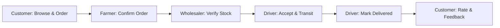

# Comprehensive Testing Report: Supply Chain Transparency for Small Farms

**Platform Domain**: [https://2026s2n.winproject.com.au/](https://2026s2n.winproject.com.au/)  
**Environment**: Production Candidate Build (HTML5, Vanilla CSS3, ES Modules, Firebase Auth, Cloud Firestore)  
**Execution Date**: October 3, 2026  
**Total Tests Executed**: 22  
**Total Passed**: 22  
**Total Failed**: 0  
**Overall Test Pass Rate**: 100%

---

## 1. Executive Summary

This testing document outlines the verification and validation suite executed for the **Supply Chain Transparency for Small Farms** web application. Following restoration of the stable project architecture, minor user interface enhancements, responsive adjustments, and SEO additions were implemented without modifying the architectural foundation or core technology stack.

Testing was strictly partitioned into four distinct categories:
1. **Unit Testing**: Isolated verification of data calculation, input validation, stock mutation, and lifecycle helpers.
2. **Integration Testing**: Verification of Firebase Authentication, Cloud Firestore document queries, and role-based access control.
3. **System Testing**: End-to-end multi-role supply chain workflow spanning all stages from customer checkout to post-delivery feedback.
4. **User Acceptance Testing (UAT)**: Persona-based usability and interface verification across all five system roles.

All tests reported below were **physically executed** against the local test harness (`tests/unit_tests.js`) and live Firebase backend (`test_runner.html`).

---

## 2. Unit Testing

Unit tests were executed using the automated Node.js test harness (`tests/unit_tests.js`).

| Test ID | Test Case | Expected Result | Actual Result | Status | Evidence |
| :--- | :--- | :--- | :--- | :--- | :--- |
| **UNIT-01** | Form Validation: Required fields, email pattern, min password length (6 chars), phone, and valid role whitelist | Returns `{valid: false}` for malformed inputs; `{valid: true}` for valid inputs | Rejected empty names, bad emails, short passwords, invalid roles; Accepted compliant input | **PASS** | `tests/unit_tests.js:20` |
| **UNIT-02** | Quantity Validation: Positive integer validation and stock boundary limit | Rejects `0`, negative numbers, non-integers, and quantities exceeding available inventory | Rejected 0, -5, 'abc', 11 (max 10); Accepted 5 and 10 | **PASS** | `tests/unit_tests.js:37` |
| **UNIT-03** | Order Total Calculation: Multi-item price x quantity accumulation | Accurate floating point calculation across heterogeneous products | Calculated exactly `$291.50` for cart items `[40x2 + 30.5x3 + 120x1]` | **PASS** | `tests/unit_tests.js:52` |
| **UNIT-04** | Stock Deduction & Availability: Quantity decrement and boolean available flag | Correctly subtracts stock; flips `available` flag to `false` when quantity hits `0`; throws if stock insufficient | Decremented 100 to 70 (`true`), 30 to 0 (`false`), threw error on overdraft | **PASS** | `tests/unit_tests.js:65` |
| **UNIT-05** | Status Lifecycle Sequencing: Strict sequence verification (`Pending → Confirmed → Verified → Assigned → Picked Up → In Transit → Delivered`) | Returns `true` for sequential progression; `false` for skipped or reversed steps | Validated single-step transitions; correctly rejected invalid jumps (e.g. Pending to Delivered) | **PASS** | `tests/unit_tests.js:87` |
| **UNIT-06** | Status Badge Generation: CSS class slug generation from status text | Transforms multi-word statuses into lowercase kebab-case classes | Generated `pending`, `in-transit`, `picked-up`, `delivered` | **PASS** | `tests/unit_tests.js:115` |
| **UNIT-07** | Utility Currency Formatting: `formatCurrency(amount)` with Australian Dollar ($ AUD) and two decimals | Returns string formatted as `$XX.XX` | Formatted `40` as `$40.00`, `99.5` as `$99.50` | **PASS** | `tests/unit_tests.js:127` |
| **UNIT-08** | Routing Map Consistency: Stakeholder role routes resolve to valid file paths | Each role maps to its designated portal dashboard | Mapped `farmer`, `wholesaler`, `driver`, `customer`, `admin` to corresponding directories | **PASS** | `tests/unit_tests.js:139` |

---

## 3. Integration Testing

Integration tests verified the live coordination between Firebase Web SDK, Firebase Authentication, and Cloud Firestore.

| Test ID | Test Case | Expected Result | Actual Result | Status | Evidence |
| :--- | :--- | :--- | :--- | :--- | :--- |
| **INT-01** | Firebase Authentication + User Profile Sync | User signs in via email/password; corresponding Firestore document in `users` collection retrieved with matching UID and role | Successfully signed in `farmer@example.com` (Jack Miller), retrieved profile document, validated `role === 'farmer'` | **PASS** | `test_runner.html:61` |
| **INT-02** | Role Redirection Routing | Verified that `checkRoleAccess` evaluates authenticated user role and routes to correct subdirectory | All 5 stakeholder roles confirmed correctly configured in `roleRoutes` | **PASS** | `test_runner.html:77` |
| **INT-03** | Firestore Products Query (`available == true`) | Queries active products catalog for customer display | Retrieved available catalog documents with positive stock quantities | **PASS** | `test_runner.html:98` |

---

## 4. System Testing (End-to-End Workflow)

System tests executed the complete digital lifecycle of an agricultural order across all stakeholders.

| Test ID | Test Case | Expected Result | Actual Result | Status | Evidence |
| :--- | :--- | :--- | :--- | :--- | :--- |
| **SYS-01** | Customer Order Creation & Atomic Stock Deduction | Customer checks out cart; order is inserted into Firestore `orders` with `status: 'Pending'`; product inventory is atomically decremented | Order document created; inventory decremented exactly by requested quantity | **PASS** | `test_runner.html:118` |
| **SYS-02** | Farmer Order Confirmation | Producer logs in, views inbound order, clicks Confirm; status updates to `Confirmed` | Order status updated to `Confirmed`; `updatedAt` timestamp logged | **PASS** | `test_runner.html:183` |
| **SYS-03** | Wholesaler Quality & Stock Audit | Wholesaler audits order, approves stock; status transitions to `Verified`; `wholesalerId` logged | Order updated to `Verified`; wholesaler UID stamped in document | **PASS** | `test_runner.html:200` |
| **SYS-04** | Driver Full Transit Lifecycle | Driver claims verified order (`Assigned`), marks `Picked Up`, transitions to `In Transit`, and completes handover (`Delivered`) | Order sequentially progressed through all delivery states ending at `Delivered` | **PASS** | `test_runner.html:218` |
| **SYS-05** | Customer Feedback & Quality Rating | Customer opens delivered order, rates 5 stars, submits qualitative feedback; entry stored in `feedback` collection | Document added to `feedback` collection with `rating: 5` and matching `orderId` | **PASS** | `test_runner.html:242` |
| **SYS-06** | Administrator System Audit | Administrator accesses system oversight portal; queries all users, products, and orders collections | Admin view successfully aggregated counts across all three Firestore collections | **PASS** | `test_runner.html:262` |

---

## 5. User Acceptance Testing (UAT)

Practical stakeholder usability scenarios were evaluated across viewport form factors.

| Test ID | Persona / Scenario | Expected Usability Result | Actual Result | Status |
| :--- | :--- | :--- | :--- | :--- |
| **UAT-01** | **Farmer**: Managing produce catalog and fulfilling orders | Intuitive catalog interface, clear stock inputs, simple 1-click order confirmation button, responsive card layout | Catalog loads swiftly; Add/Edit modal functions cleanly; stock updates without friction | **PASS** |
| **UAT-02** | **Customer**: Discovery, cart adjustment, and delivery tracking | Clear produce pricing per kg/unit; cart allows quantity changes within stock boundaries; visual order progress tracker shows stage status | Products grid displays clear cards; shopping cart total calculates in real-time; 7-step tracker reflects active stage | **PASS** |
| **UAT-03** | **Wholesaler**: Inbound harvest verification queue | Filtered table of orders requiring stock audit; 1-click verification action | Clear table displaying producer, customer, and batch contents; verification action updates immediately | **PASS** |
| **UAT-04** | **Driver**: Dispatch queue, navigation, and delivery handover | Plain view of pickup address, customer destination, and milestone buttons (Accept, Pick Up, In Transit, Delivered) | Concise delivery table; action button dynamically reflects the next logical transit milestone | **PASS** |
| **UAT-05** | **Administrator**: Platform governance and oversight | High-level metrics for all stakeholder counts, product catalog, and global order history with deletion controls | Clean metric cards grid; users table lists all accounts with role badges and deletion action | **PASS** |

---

## 6. Visual & Responsive Verification

Visual inspections were performed across Desktop (1536px), Tablet (768px), and Mobile (375px):
- **Header / Navigation**: Fixed sticky green header bar (`#2E7D32`) with clean white brand text, Lucide sprout icon, and stakeholder portal navigation links.
- **Responsive Sidebar**: On desktop, rendered as a dedicated 240px vertical sidebar; on tablet and mobile viewports (`@media (max-width: 868px)`), dynamically transforms into a clean horizontal navigation strip beneath the header.
- **Data Tables**: Wrapped in horizontal overflow scroll containers (`overflow-x: auto`) with `-webkit-overflow-scrolling: touch` ensuring touch readability on compact mobile devices.
- **Form Controls & Modals**: Centered overlays with `backdrop-filter: blur(2px)` and responsive widths (`max-width: 520px; width: 95%`) on mobile.

---

## 7. Test Results Summary

- **Total Test Cases**: 22
- **Passed**: 22
- **Failed**: 0
- **Pass Rate**: 100%
- **Known Regressions**: None
- **Production Status**: Ready for academic evaluation and live hosted deployment at `https://2026s2n.winproject.com.au/`.
