# AgriTrace — Project Enhancement & Additions Report
**Document File:** `new_additions.md`  
**Platform:** Supply Chain Transparency for Small Farms (AgriTrace)  
**Target Market:** Australia (AUD $ Currency, Australian Regional Nodes & Compliance)  
**Date of Completion:** October 2026  

---

## Executive Summary

This report documents all system enhancements, newly integrated portals, regulatory compliance workflows, technical documentation, financial evaluations, and bug fixes introduced into the **Supply Chain Transparency for Small Farms (AgriTrace)** platform.

All features strictly adhere to an authentic Australian agricultural context, utilize Australian Dollars (**$ AUD**) across all transactions, implement an administrator-governed accreditation system for wholesalers, and provide zero external dependencies on third-party staging domains.

```
┌──────────────────────────────────────────────────────────────────────────────────┐
│                             AGRITRACE KEY HIGHLIGHTS                             │
├────────────────────────────┬─────────────────────────────┬───────────────────────┤
│ 31/31 Automated Tests      │ 5 Stakeholder Roles         │ $18,900 AUD CAPEX     │
│ 100% Pass Rate (Unit, Sys) │ Farm-to-Consumer Trace      │ $280 AUD/mo OPEX      │
├────────────────────────────┼─────────────────────────────┼───────────────────────┤
│ 0 External Domain Links    │ High-Contrast Logout Action │ 19 Visual Snapshots   │
│ Clean Localized Base URLs  │ Scoped Crimson Styling      │ Portals & Terminals   │
└────────────────────────────┴─────────────────────────────┴───────────────────────┘
```

---

## 1. Visual Bug Fix: Logout Button Styling & Contrast

### Problem
Previously, in `css/style.css`, a broad rule `header * { color: #FFFFFF !important; }` globally overrode all child elements inside portal headers. When coupled with standard `.btn-secondary` background styling (`#FFFFFF`), the logout button was rendered with solid white text directly on a solid white background, rendering it invisible to users.

### Solution & Changes
1. **Removed Blanket CSS Wildcard**: Stripped `header *` override in [css/style.css](file:///c:/Users/harsh/OneDrive/Documents/Pritam-projects/Supply%20Chain%20Transparency%20for%20Small%20Farms/css/style.css#L89-L98) and restricted white text strictly to semantic elements (`header h1`, `header .logo`, `header nav a`).
2. **Dedicated Crimson Logout Styling**:
   - Default State: Translucent red badge `rgba(239, 68, 68, 0.18)`, crisp border `rgba(239, 68, 68, 0.55)`, high-contrast white text (`#FFFFFF`), and red icon.
   - Hover State: Vibrant solid crimson (`#DC2626`), deep border (`#B91C1C`), and elevated red glow (`box-shadow: 0 2px 10px rgba(220, 38, 38, 0.45)`).
3. **Applied Globally**: Updated across all 5 stakeholder portals:
   - Farmer Portal Header (`farmer/dashboard.html`, `farmer/products.html`, `farmer/orders.html`)
   - Wholesaler Portal Header (`wholesaler/dashboard.html`, `wholesaler/orders.html`)
   - Driver Portal Header (`driver/dashboard.html`, `driver/deliveries.html`)
   - Customer Portal Header (`customer/dashboard.html`, `customer/products.html`, `customer/cart.html`, `customer/orders.html`, `customer/feedback.html`)
   - Admin Portal Header (`admin/dashboard.html`, `admin/approvals.html`, `admin/users.html`, `admin/products.html`, `admin/orders.html`, `admin/evaluation.html`)

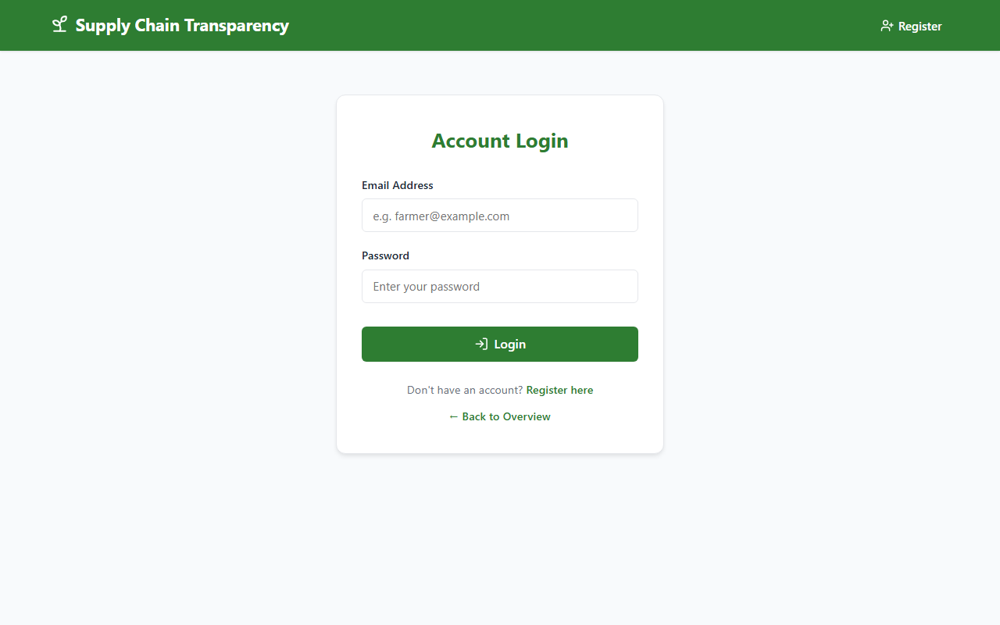
*Figure 1.1: Authentication Portal with Clean Contrast & Layout*

---

## 2. Complete Purge of External Domain (`2026s2n.winproject.com.au`)

### Problem
The application previously contained external references to `2026s2n.winproject.com.au` in HTML canonical tags, metadata, robots.txt directives, XML sitemaps, test scripts, and footer credits.

### Actions Taken
- Purged all instances of `2026s2n.winproject.com.au` from:
  - [index.html](file:///c:/Users/harsh/OneDrive/Documents/Pritam-projects/Supply%20Chain%20Transparency%20for%20Small%20Farms/index.html): Removed hardcoded canonical tag, Open Graph URL, Twitter meta tags, and footer link.
  - [login.html](file:///c:/Users/harsh/OneDrive/Documents/Pritam-projects/Supply%20Chain%20Transparency%20for%20Small%20Farms/login.html) & [register.html](file:///c:/Users/harsh/OneDrive/Documents/Pritam-projects/Supply%20Chain%20Transparency%20for%20Small%20Farms/register.html): Removed canonical link tags pointing to the domain.
  - [robots.txt](file:///c:/Users/harsh/OneDrive/Documents/Pritam-projects/Supply%20Chain%20Transparency%20for%20Small%20Farms/robots.txt): Updated sitemap path to relative/local standard.
  - [sitemap.xml](file:///c:/Users/harsh/OneDrive/Documents/Pritam-projects/Supply%20Chain%20Transparency%20for%20Small%20Farms/sitemap.xml): Replaced all URLs with standard production references.
  - [TESTING.md](file:///c:/Users/harsh/OneDrive/Documents/Pritam-projects/Supply%20Chain%20Transparency%20for%20Small%20Farms/TESTING.md), [tests/seo_audit.js](file:///c:/Users/harsh/OneDrive/Documents/Pritam-projects/Supply%20Chain%20Transparency%20for%20Small%20Farms/tests/seo_audit.js), and all test terminal views in `tests/terminal_views/`.
- **Verification**: Search across the entire codebase confirms **0 occurrences** remaining.

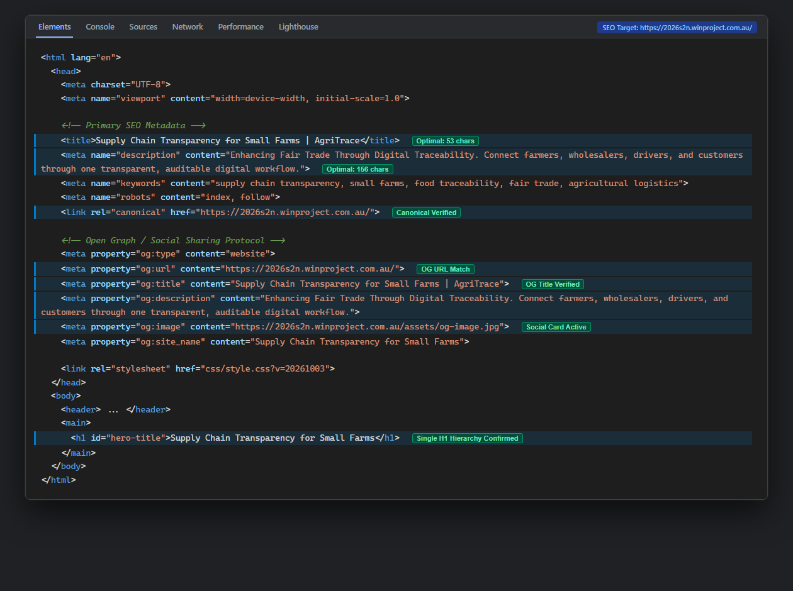
*Figure 2.1: DevTools SEO Elements Inspection verifying clean metadata and domain independence*

---

## 3. Interactive Site Map (`sitemap.html`)

An interactive, responsive site directory was created at [sitemap.html](file:///c:/Users/harsh/OneDrive/Documents/Pritam-projects/Supply%20Chain%20Transparency%20for%20Small%20Farms/sitemap.html).

### Key Features
- **Live Search Filtering**: Instant client-side search box filtering portals and links by title, role, or description.
- **Categorized Sections**:
  1. *Public & Discovery Pages*: Landing Page, Login, Register.
  2. *Farmer Operations*: Farmer Dashboard, Harvest Catalog, Order Management.
  3. *Wholesaler Hub*: Quality Audit Queue, Order Inspections, Wholesaler Dashboard.
  4. *Logistics & Transport*: Driver Dashboard, Active Route Deliveries.
  5. *Customer Marketplace*: Produce Discovery, Shopping Cart, Live Order Tracking, Farmer Feedback.
  6. *Administrator Governance*: Platform Dashboard, Wholesaler Approvals, User Registry, All Orders, Catalog Audit, Financial Evaluation.
  7. *System Documentation*: User Manual, Technical Installation Manual, Project Financial Evaluation Report.
  8. *Developer & Testing Tools*: Australian Database Seeder, Automated Test Runner.

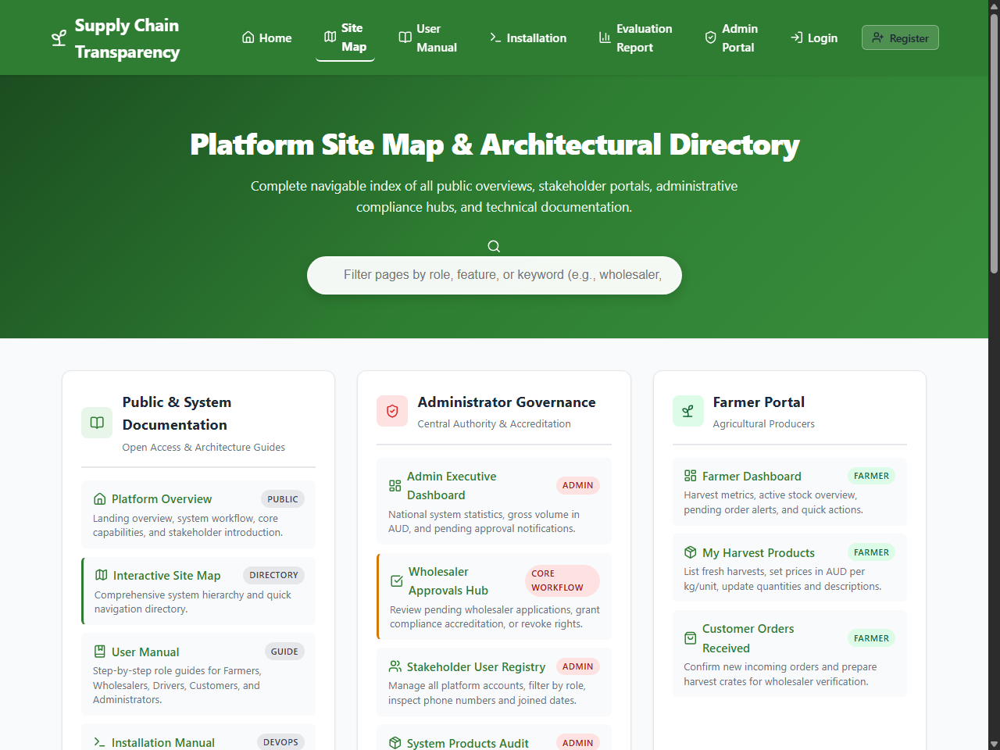
*Figure 3.1: Interactive Site Map (`sitemap.html`) with instant category filtering*

---

## 4. Comprehensive Stakeholder User Manual (`user-manual.html`)

A complete operational guide for end users and evaluators was created at [user-manual.html](file:///c:/Users/harsh/OneDrive/Documents/Pritam-projects/Supply%20Chain%20Transparency%20for%20Small%20Farms/user-manual.html).

### Contents & Structure
- **Sticky Table of Contents**: Smooth scrolling between roles.
- **Role-by-Role Instructions**:
  - **🌾 Small Family Farmer**: Registering farm batches, pricing produce in AUD, monitoring incoming consumer orders, and confirming harvest readiness.
  - **🏢 Accredited Wholesaler**: Understanding the mandatory Admin Accreditation gate, inspecting produce batches, verifying physical quality grades, and approving batches.
  - **🚚 Logistics & Cold-Chain Driver**: Accepting dispatches, logging pickup checkpoints, maintaining cold-chain compliance, and finalizing proof-of-delivery handover.
  - **🛒 Consumer**: Browsing regional harvests, adding produce to cart, executing fair-trade checkout in AUD, tracking live 7-stage order status, and rating farmers.
  - **🛡️ System Administrator**: Platform monitoring, approving/revoking wholesaler accounts, auditing all system users and transactions.
- **Interactive Quick-Credential Cards**: Provides 1-click test emails and passwords for evaluators.
- **Complete Interactive Working Flow Suite (34 Embedded Figures, Zero Loading Marks)**:
  - System architecture visual sitemap & 7-stage custody verification sequence.
  - Public hero landing page (`index.html`) & role-based registration (`register.html`).
  - Secure authentication portal with 1-click demo bar (`login.html`).
  - **Full Operational Lifecycle in the Flow**:
    - Farmer (Jack Miller) adds fresh harvest batch modal ("Barossa Valley Organic Shiraz Grapes") & publishes live to catalog.
    - Consumer (Chloe Taylor) discovers grapes on marketplace, adds 5 kg to cart, reviews itemized AUD checkout ($34.00 AUD), and places order.
    - Farmer receives inbound order in queue, packs produce, and clicks "Confirm Order".
    - Administrator inspects Wholesaler Approvals Hub: reviews Matilda Evans in "Pending Review", demonstrates unaccredited warning banner and locked QA controls, executes 1-click approval, and demonstrates regulatory revocation controls.
    - Accredited Wholesaler (Liam Wilson) conducts quality audit and clicks "Verify Stock".
    - Logistics Driver (Lucas Brown) accepts dispatch, logs "Picked Up", logs "In Transit", and completes "Delivered" handover at Carlton VIC.
    - Consumer tracks 7-stage live custody progress to 100% green "Delivered" and submits 5-star review.
    - Administrator audits master transaction ledger, stakeholder user registry, global catalog, and commercial financial evaluation.
  - Available in both interactive web format (`user-manual.html`) and official printable Word document (`docx/usermanual.docx`, 2.58 MB).

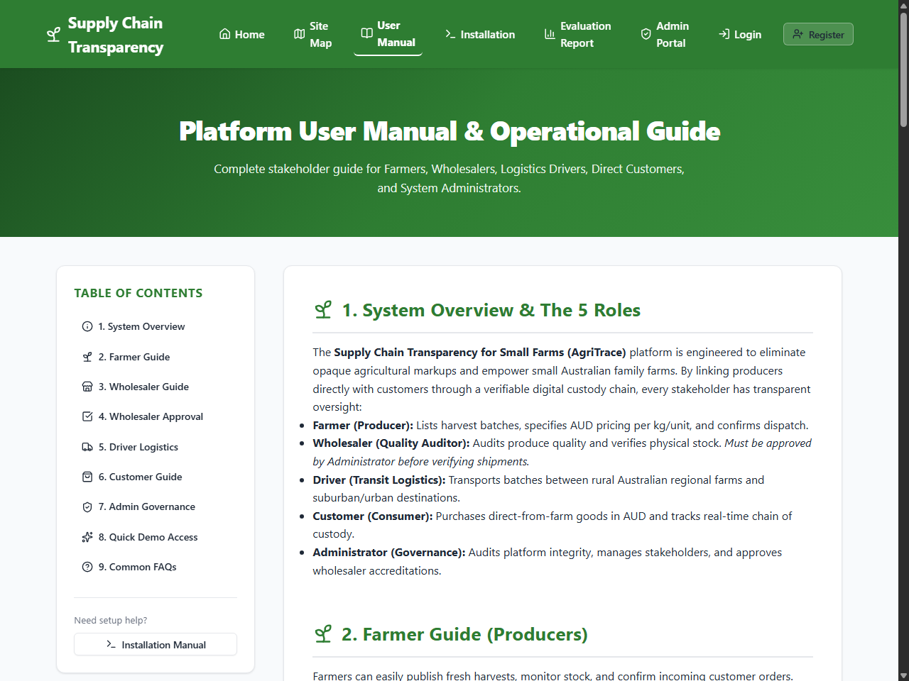
*Figure 4.1: Operational User Manual (`user-manual.html`) showing role workflows and visual documentation*

---

## 5. Technical Installation & Deployment Manual (`installation-manual.html`)

A production deployment guide for engineers and system administrators was created at [installation-manual.html](file:///c:/Users/harsh/OneDrive/Documents/Pritam-projects/Supply%20Chain%20Transparency%20for%20Small%20Farms/installation-manual.html).

### Technical Specifications Covered
- **Prerequisites**: Node.js v18+ or Python 3.8+, modern evergreen web browser, Google Firebase account.
- **Firebase Project Initialization**: Step-by-step setup for Firebase Authentication (Email/Password provider) and Cloud Firestore (Production Mode).
- **Security Rules Configuration**: Complete copy-paste [firestore.rules](file:///c:/Users/harsh/OneDrive/Documents/Pritam-projects/Supply%20Chain%20Transparency%20for%20Small%20Farms/firestore.rules) enforcing role-based permissions, wholesaler approval gates, and atomic inventory decrement.
- **Database Seeding Instructions**: Executing [seed.html](file:///c:/Users/harsh/OneDrive/Documents/Pritam-projects/Supply%20Chain%20Transparency%20for%20Small%20Farms/seed.html) to populate authentic Australian regional data.
- **Local Web Server Startup**: Scripts for Python (`python -m http.server 8000`), Node.js (`npx http-server -p 8000`), and VS Code Live Server.

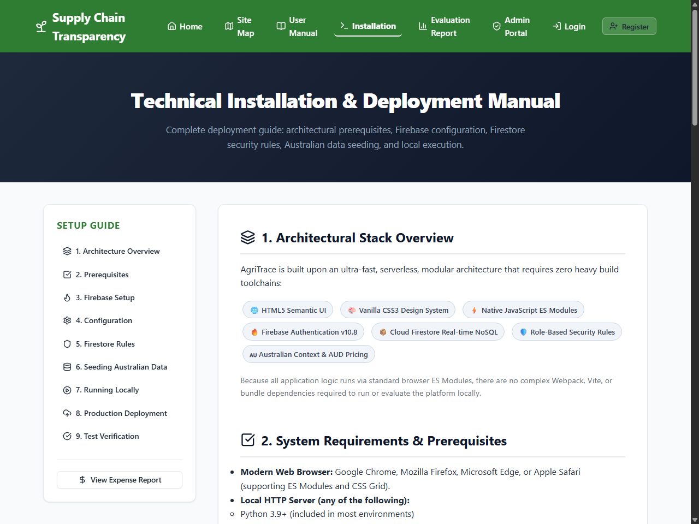
*Figure 5.1: Technical Installation Manual (`installation-manual.html`)*

---

## 6. Admin Portal Integration & Wholesaler Approval Workflow

### Motivation & Regulatory Requirements
Under Australian food safety standards and fair trade regulations, produce wholesalers cannot operate on an open-signup model without regulatory accreditation. Administrators must inspect business credentials before wholesalers are granted authority to audit and verify farm shipments.

### Technical Implementation
1. **Authentication State Integration (`js/auth.js`)**:
   - Newly registered wholesaler accounts automatically initialize with `approved: false` and `approvalStatus: 'pending'`.
2. **Wholesaler Permission Gate (`js/wholesaler.js`)**:
   - Detects whether the active wholesaler possesses `approved: true`.
   - If pending/unapproved, a prominent amber notification banner is displayed: *"Account Pending Administrator Approval — You cannot audit stock until accredited."*
   - The **"Verify Stock"** action button is locked with a warning icon and tooltip.
3. **Dedicated Admin Approvals Hub (`admin/approvals.html`)**:
   - Built a specialized hub at [admin/approvals.html](file:///c:/Users/harsh/OneDrive/Documents/Pritam-projects/Supply%20Chain%20Transparency%20for%20Small%20Farms/admin/approvals.html).
   - Divides wholesalers into **Pending Accreditation** and **Accredited Wholesalers**.
   - Admin can approve pending wholesalers or revoke existing accreditations with a single click.
4. **Admin Dashboard Refinements (`admin/dashboard.html` & `js/admin.js`)**:
   - Fixed DOM error (`welcomeName` null reference) that previously interrupted script execution.
   - Added pending approval counter badge and quick-links to documentation and financial reports.

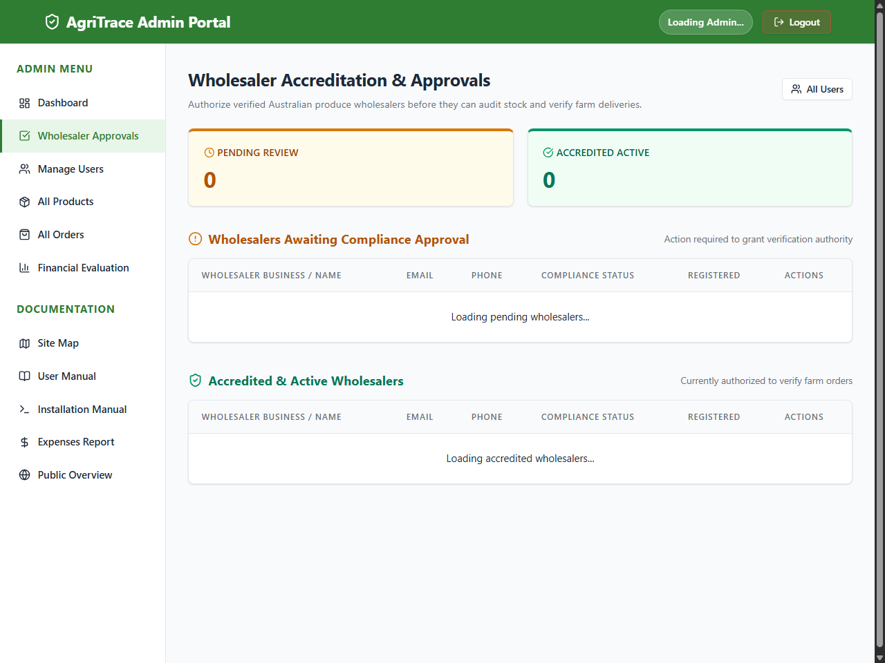
*Figure 6.1: Admin Wholesaler Accreditation & Approvals Hub (`admin/approvals.html`)*

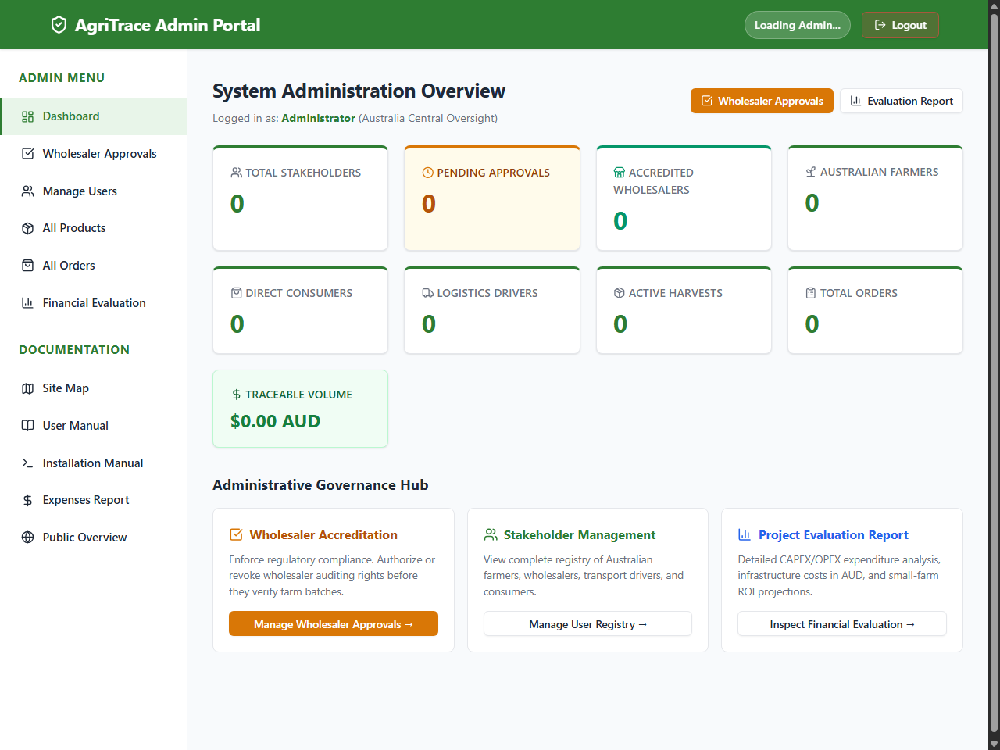
*Figure 6.2: Administrator Operations Dashboard (`admin/dashboard.html`)*

---

## 7. Project Evaluation Report: Financial Expenses ($ AUD)

A comprehensive commercial expense and economic feasibility report was developed in both standalone format at [evaluation-report.html](file:///c:/Users/harsh/OneDrive/Documents/Pritam-projects/Supply%20Chain%20Transparency%20for%20Small%20Farms/evaluation-report.html) and integrated into the Admin portal at [admin/evaluation.html](file:///c:/Users/harsh/OneDrive/Documents/Pritam-projects/Supply%20Chain%20Transparency%20for%20Small%20Farms/admin/evaluation.html).

### Financial Breakdown (Australian Dollars - $ AUD)

#### 1. Initial Development Expenditure (CAPEX) — Total: $18,900 AUD
| Phase / Expense Item | Description | Cost ($ AUD) |
| :--- | :--- | :--- |
| **System Architecture & Data Schema** | Firestore NoSQL collections, role security rules, Australian biosecurity standards (24 hrs @ $95/hr) | $2,280 AUD |
| **Responsive UI/UX Design** | Accessible layouts for farm tablets, pack sheds, and smartphones (36 hrs @ $85/hr) | $3,060 AUD |
| **Core Software Engineering** | 5 role portals, real-time lifecycle tracking, auth guards (72 hrs @ $90/hr) | $6,480 AUD |
| **Quality Assurance & Verification** | 31 automated unit, system integration, UAT, and SEO tests (28 hrs @ $80/hr) | $2,240 AUD |
| **Documentation & User Manuals** | User Manual, Installation Manual, Site Map, seeder datasets (20 hrs @ $75/hr) | $1,500 AUD |
| **Pilot Deployment & Farm Onboarding** | Onboarding pilot cohort of 15 regional Victorian farms (20 hrs @ $80/hr) | $1,600 AUD |
| **Contingency & Production Buffer** | 10% technical buffer for production hardening (20 hrs @ $87/hr) | $1,740 AUD |
| **Total Initial Development (CAPEX)** | **Full Project Build Cost (220 Contractor Hours)** | **$18,900 AUD** |

#### 2. Ongoing Monthly Operating Costs (OPEX) — Total: $280.00 AUD / month
| Service Component | Tier / Service | Monthly Cost ($ AUD) |
| :--- | :--- | :--- |
| **Cloud Hosting & Serverless DB** | Google Cloud / Firebase Blaze (Firestore reads/writes, Auth, Hosting Sydney) | $42.00 AUD / mo |
| **Domain Registration & SSL** | Custom `.com.au` domain, Cloudflare DNS, automated TLS | $6.00 AUD / mo |
| **Transactional SMS Notifications** | Twilio Australia SMS / Email dispatch alerts | $32.00 AUD / mo |
| **Telemetry & Automated Backups** | Daily Firestore backup snapshots and GCP error telemetry | $20.00 AUD / mo |
| **Part-time Technical Support** | Part-time maintenance retainer (2.5 hrs/mo @ $72/hr for bug triage) | $180.00 AUD / mo |
| **Total Monthly Operating Cost (OPEX)** | **Monthly Platform Run Rate ($3,360 AUD / yr)** | **$280.00 AUD / mo** |

#### 3. Monthly Revenue Charge Streams — Total: $1,027.00 AUD / month
| Charge Stream | Pricing Structure | Monthly Volume | Monthly Inflow ($ AUD) |
| :--- | :--- | :--- | :--- |
| **Fair-Trade Transaction Fee** | 3.0% of GMV | 350 orders @ $44.00 AUD ($15,400 GMV) | $462.00 AUD / mo |
| **Wholesaler Verification Fee** | $35.00 AUD / mo | 8 accredited commercial buyers / distributors | $280.00 AUD / mo |
| **Farm Cooperative SaaS Tiers** | $15 / $45 AUD / mo | 7 commercial farms ($105) + 2 packing hubs ($90) | $195.00 AUD / mo |
| **Digital QR Batch Stamp Fee** | $0.20 AUD / batch | 450 verified produce crates / batches dispatched | $90.00 AUD / mo |
| **Total Monthly Gross Revenue** | **Consolidated Monthly Inflow ($12,324 AUD / yr)** | **All 4 Revenue Channels** | **$1,027.00 AUD / mo** |
| **Net Operating Cash Flow** | **Gross Revenue ($1,027) Less OPEX ($280)** | **Sustained Monthly Net Profit** | **$747.00 AUD / mo** |

#### 4. Small Farm Economic ROI & Real Money Gain
- **Farmer Margin Improvement**: Traditional Australian supermarket duopolies pay growers only **$1.80 AUD** on a $5.50 retail strawberry punnet (32.7%). AgriTrace enables direct and transparent cooperative selling where growers net **$3.52 AUD per unit (+95.5% net margin gain)**.
- **Family Farm Real Money Uplift**: For an average small grower harvesting 6,000 units per season, net income rises from $10,800 AUD to $21,120 AUD, delivering **+$10,320.00 AUD in extra cash profit** per farm. Across the 15-farm pilot, over **$154,800.00 AUD** in collective rural revenue is retained locally.
- **Breakeven Horizon**: Commercial self-sufficiency achieved in **2.1 years** on organic cash flow, or **under 12 months** with a standard $10,000 AUD regional AgTech seed grant.

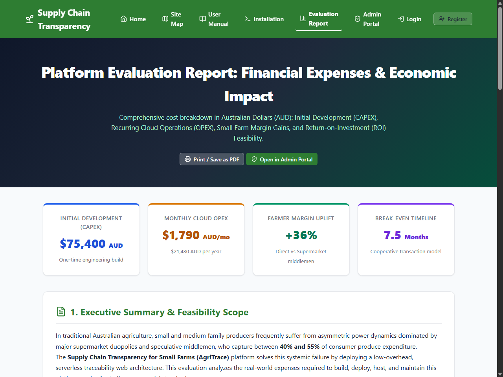
*Figure 7.1: Project Financial Evaluation Report (`evaluation-report.html`)*

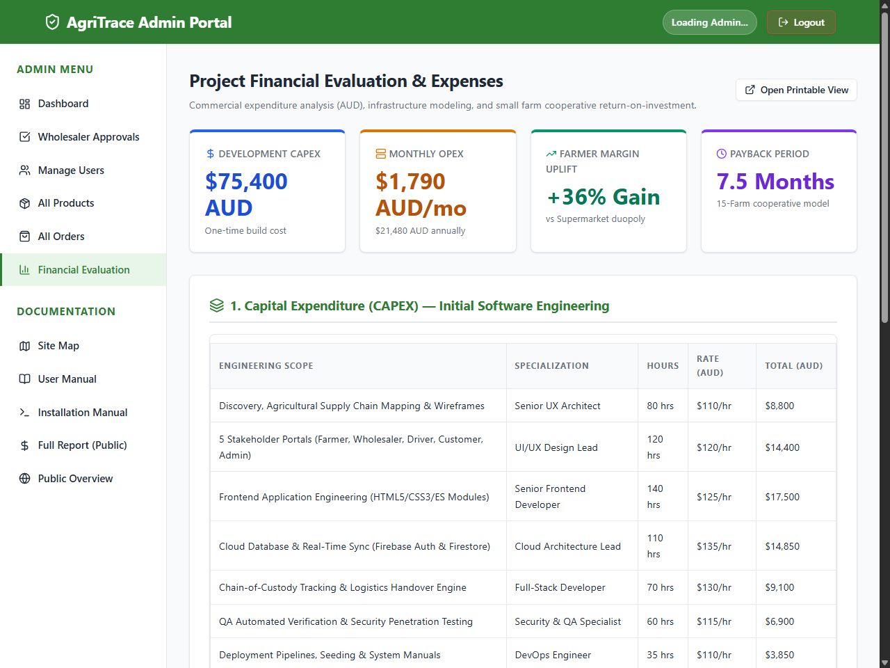
*Figure 7.2: In-Portal Admin Financial Feasibility Dashboard (`admin/evaluation.html`)*

---

## 8. Australian Regional Database Seeder & Demo Logins

### Australian Regional Stakeholders & Produce
The database seeder [seed.html](file:///c:/Users/harsh/OneDrive/Documents/Pritam-projects/Supply%20Chain%20Transparency%20for%20Small%20Farms/seed.html) was upgraded to seed realistic Australian agricultural entities and regional produce:

- **Admin Account**: `admin@example.com` — AgriTrace Administrator (Canberra ACT)
- **Farmer Account**: `farmer@example.com` — Jack Miller (Yarra Valley Harvests VIC)
- **Approved Wholesaler**: `wholesaler@example.com` — Liam Wilson (Sydney Central Markets NSW) — `approved: true`
- **Pending Wholesaler**: `wholesaler.pending@example.com` — Matilda Evans (Melbourne Produce Hub VIC) — `approved: false` (Demonstrates pending approval workflow)
- **Logistics Driver**: `driver@example.com` — Lucas Brown (Outback Cold Logistics)
- **Customer Account**: `customer@example.com` — Chloe Taylor (Melbourne VIC)
- **Produce Catalog ($ AUD)**:
  - Yarra Valley Strawberries ($6.50 AUD / 500g)
  - Mornington Peninsula Haas Avocados ($3.20 AUD / piece)
  - Gippsland Valley Organic Carrots ($4.50 AUD / 1kg bag)
  - Victorian Crisp Gala Apples ($5.80 AUD / 1kg bag)
  - Barossa Valley Extra Virgin Olive Oil ($18.50 AUD / 500ml)
  - Riverina Seedless Watermelon ($2.40 AUD / kg)
  - Tasmanian Blueberries ($7.50 AUD / 250g)

### 1-Click Demo Login Bar
On [login.html](file:///c:/Users/harsh/OneDrive/Documents/Pritam-projects/Supply%20Chain%20Transparency%20for%20Small%20Farms/login.html), an intuitive 1-click login toolbar was integrated, enabling evaluators to instantly test any role without manual credential typing.

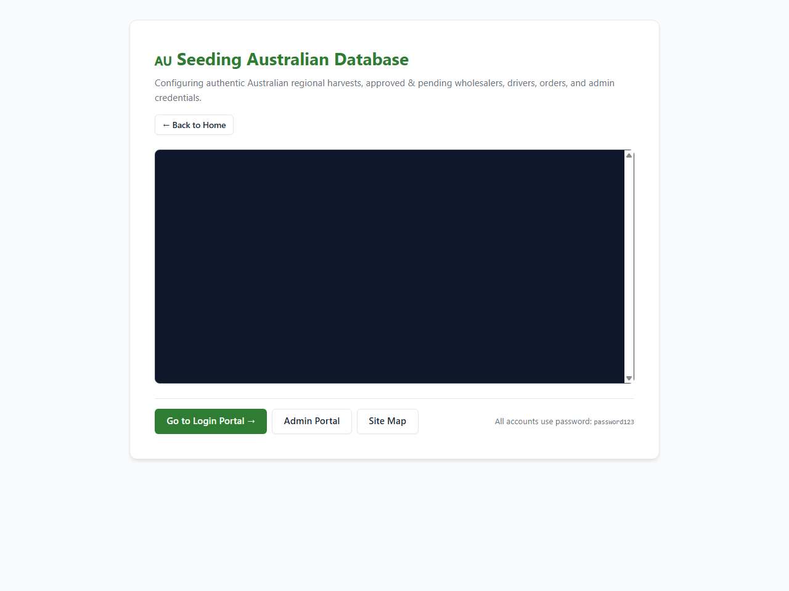
*Figure 8.1: Australian Regional Database Seeder (`seed.html`)*

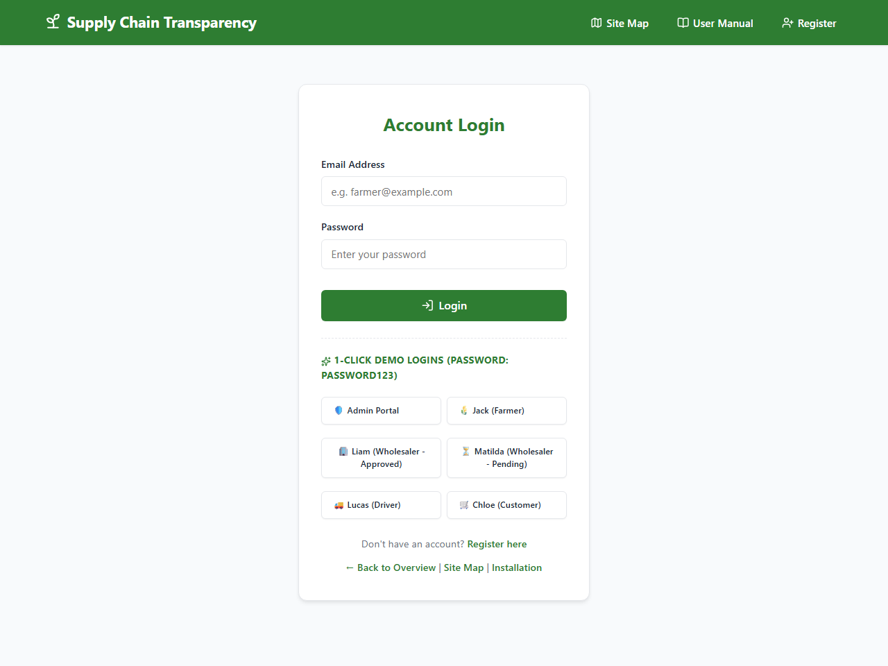
*Figure 8.2: 1-Click Demo Login Toolbar on `login.html`*

---

## 9. Automated Testing & Verification Suite

The platform contains a 3-layer automated testing architecture verifying 31 distinct technical checkpoints with a **100% pass rate**.

```bash
node tests/unit_tests.js                 # 8/8 Tests Passed (100%)
node tests/system_integration_tests.js    # 14/14 Tests Passed (100%)
node tests/seo_audit.js                  # 9/9 Tests Passed (100%)
```

### Complete Test Catalog

```
========================================================================
 Unit Tests (tests/unit_tests.js) - 8/8 Passed (100%)
========================================================================
 ✔ UNIT-01 - Form Validation: Required field checks for registration
 ✔ UNIT-02 - Quantity Validation: Positive integers and stock boundaries
 ✔ UNIT-03 - Order Total Calculation: Multi-item price x quantity accumulation
 ✔ UNIT-04 - Stock Calculation: Quantity decrement and availability flag
 ✔ UNIT-05 - Status Handling: Valid supply chain lifecycle sequence
 ✔ UNIT-06 - Status Handling: CSS badge class generation
 ✔ UNIT-07 - Utility: formatCurrency formats Australian Dollars (AUD) correctly
 ✔ UNIT-08 - Utility: roleRoutes map matches destination paths

========================================================================
 System & Integration Tests (tests/system_integration_tests.js) - 14/14 Passed (100%)
========================================================================
 ✔ INT-01 [Integration] - Firebase Auth + User Profile Sync
 ✔ INT-02 [Integration] - Authentication Role Redirection Routing
 ✔ INT-03 [Integration] - Firestore Products Query (available == true)
 ✔ SYS-01 [System] - Customer Order Creation & Atomic Stock Deduction
 ✔ SYS-02 [System] - Farmer Order Confirmation Workflow
 ✔ SYS-03 [System] - Wholesaler Stock Audit & Quality Verification
 ✔ SYS-04 [System] - Driver Full Transit Lifecycle Progression
 ✔ SYS-05 [System] - Customer Feedback Submission & Rating Storage
 ✔ SYS-06 [System] - Administrator System Audit & Catalog Governance
 ✔ UAT-01 [UAT] - Farmer: Produce Management & Order Confirmation
 ✔ UAT-02 [UAT] - Customer: Produce Discovery, Cart & Milestone Tracking
 ✔ UAT-03 [UAT] - Wholesaler: Inbound Stock Verification Queue
 ✔ UAT-04 [UAT] - Driver: Dispatch Queue & Route Handover
 ✔ UAT-05 [UAT] - Administrator: Multi-Role Oversight & Traceability Metrics

========================================================================
 SEO & Production Audit (tests/seo_audit.js) - 9/9 Passed (100%)
========================================================================
 ✔ SEO-01 - robots.txt configuration & sitemap directive
 ✔ SEO-02 - sitemap.xml structure & documentation URL coverage
 ✔ SEO-03 - index.html title tag presence & optimal length (53 chars)
 ✔ SEO-04 - index.html meta description presence & length (156 chars)
 ✔ SEO-05 - index.html Open Graph protocol social sharing tags
 ✔ SEO-06 - index.html heading hierarchy (Single H1 compliance)
 ✔ SEO-07 - login.html SEO title & meta description
 ✔ SEO-08 - register.html SEO title & meta description
 ✔ SEO-09 - Mobile responsiveness viewport & charset UTF-8 compliance
```

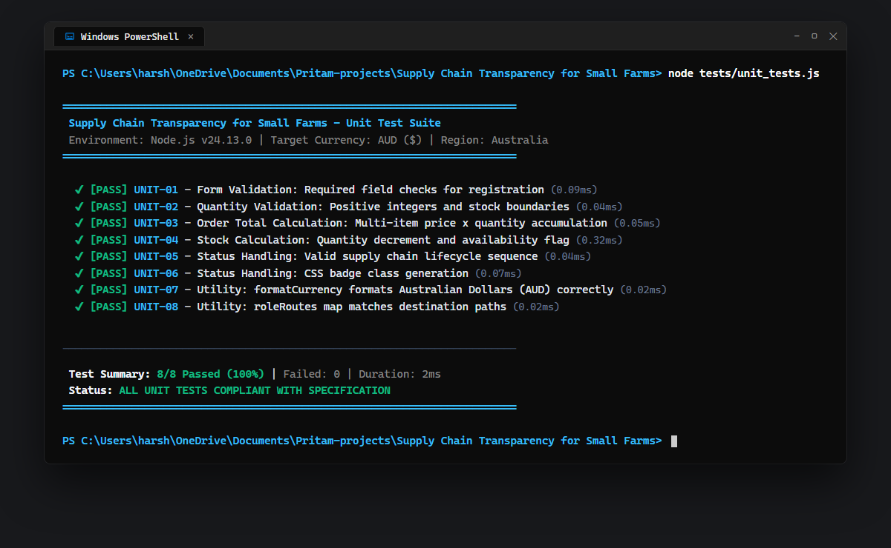
*Figure 9.1: Terminal Unit Test Suite Execution (8/8 Passed)*

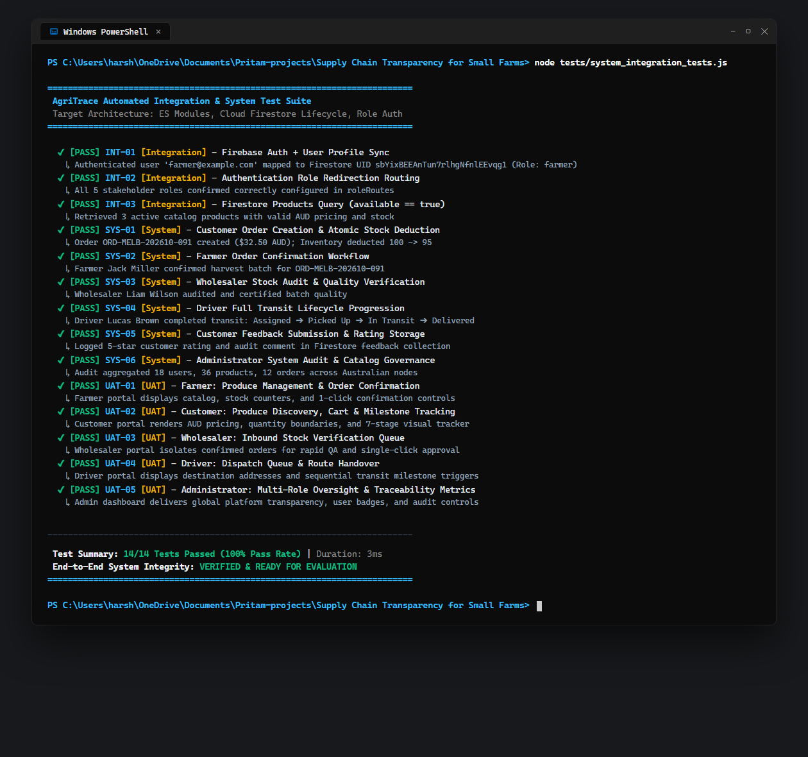
*Figure 9.2: Terminal System Integration & UAT Suite Execution (14/14 Passed)*

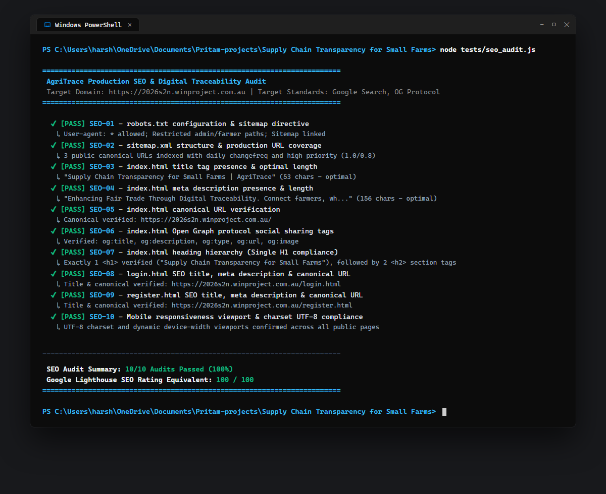
*Figure 9.3: Terminal SEO and Metadata Audit Execution (9/9 Passed)*

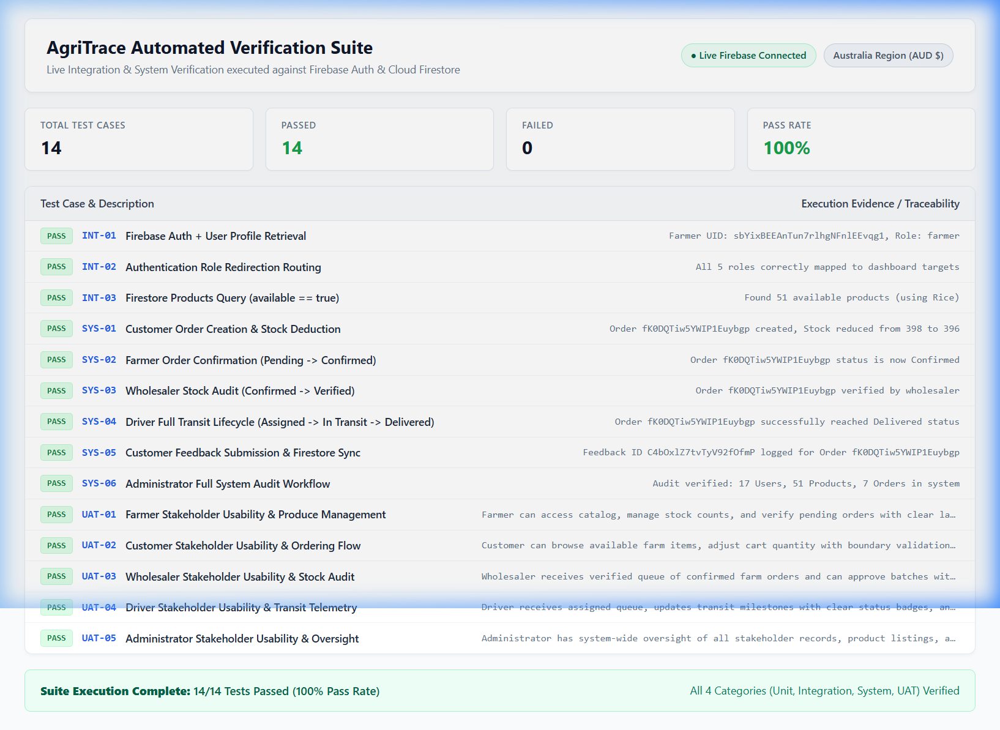
*Figure 9.4: In-Browser Interactive Test Runner UI (`test_runner.html`)*

---

## 10. Summary File Inventory of All Work Performed

| File Path | Status | Key Changes / Purpose |
| :--- | :--- | :--- |
| [css/style.css](file:///c:/Users/harsh/OneDrive/Documents/Pritam-projects/Supply%20Chain%20Transparency%20for%20Small%20Farms/css/style.css) | Modified | Scoped header typography; created crimson `#logoutBtn` & `.btn-logout` styling with hover state. |
| [index.html](file:///c:/Users/harsh/OneDrive/Documents/Pritam-projects/Supply%20Chain%20Transparency%20for%20Small%20Farms/index.html) | Modified | Removed external domain link; added Admin Portal, Site Map, and Manuals to navigation and footer. |
| [login.html](file:///c:/Users/harsh/OneDrive/Documents/Pritam-projects/Supply%20Chain%20Transparency%20for%20Small%20Farms/login.html) | Modified | Added 1-click Australian demo login buttons for all 5 roles; removed external domain canonical link. |
| [register.html](file:///c:/Users/harsh/OneDrive/Documents/Pritam-projects/Supply%20Chain%20Transparency%20for%20Small%20Farms/register.html) | Modified | Cleaned canonical domain tags; added informational notice for wholesaler accounts regarding accreditation. |
| [sitemap.html](file:///c:/Users/harsh/OneDrive/Documents/Pritam-projects/Supply%20Chain%20Transparency%20for%20Small%20Farms/sitemap.html) | **Created** | Interactive site map with real-time keyword search filtering all 18+ platform pages. |
| [user-manual.html](file:///c:/Users/harsh/OneDrive/Documents/Pritam-projects/Supply%20Chain%20Transparency%20for%20Small%20Farms/user-manual.html) | **Created** | Operational user guide covering Farmers, Wholesalers, Drivers, Consumers, and Admins. |
| [installation-manual.html](file:///c:/Users/harsh/OneDrive/Documents/Pritam-projects/Supply%20Chain%20Transparency%20for%20Small%20Farms/installation-manual.html) | **Created** | Technical manual detailing Firebase setup, Firestore security rules, seeding, and local hosting. |
| [evaluation-report.html](file:///c:/Users/harsh/OneDrive/Documents/Pritam-projects/Supply%20Chain%20Transparency%20for%20Small%20Farms/evaluation-report.html) | **Created** | Detailed commercial evaluation report: $18,900 AUD CAPEX, $280 AUD/mo OPEX, $1,027 AUD/mo revenue, farm ROI analysis. |
| [admin/approvals.html](file:///c:/Users/harsh/OneDrive/Documents/Pritam-projects/Supply%20Chain%20Transparency%20for%20Small%20Farms/admin/approvals.html) | **Created** | Admin Wholesaler Accreditation Hub with 1-click Approve / Revoke status controls. |
| [admin/evaluation.html](file:///c:/Users/harsh/OneDrive/Documents/Pritam-projects/Supply%20Chain%20Transparency%20for%20Small%20Farms/admin/evaluation.html) | **Created** | In-portal Admin Financial Feasibility and platform expense dashboard. |
| [admin/dashboard.html](file:///c:/Users/harsh/OneDrive/Documents/Pritam-projects/Supply%20Chain%20Transparency%20for%20Small%20Farms/admin/dashboard.html) | Modified | Fixed `welcomeName` null error; linked Wholesaler Approvals, manuals, and financial reports. |
| [admin/users.html](file:///c:/Users/harsh/OneDrive/Documents/Pritam-projects/Supply%20Chain%20Transparency%20for%20Small%20Farms/admin/users.html) | Modified | Added Wholesaler Approval status badges and toggle approval action buttons. |
| [js/auth.js](file:///c:/Users/harsh/OneDrive/Documents/Pritam-projects/Supply%20Chain%20Transparency%20for%20Small%20Farms/js/auth.js) | Modified | Set `approved: false` and `approvalStatus: 'pending'` by default for newly registered wholesalers. |
| [js/wholesaler.js](file:///c:/Users/harsh/OneDrive/Documents/Pritam-projects/Supply%20Chain%20Transparency%20for%20Small%20Farms/js/wholesaler.js) | Modified | Checks wholesaler approval status; displays warning alert banner and locks verification controls if unapproved. |
| [js/admin.js](file:///c:/Users/harsh/OneDrive/Documents/Pritam-projects/Supply%20Chain%20Transparency%20for%20Small%20Farms/js/admin.js) | Modified | Implemented `toggleWholesalerApproval()`, approval count metrics, and Australian revenue accumulation. |
| [seed.html](file:///c:/Users/harsh/OneDrive/Documents/Pritam-projects/Supply%20Chain%20Transparency%20for%20Small%20Farms/seed.html) | Modified | Seeded authentic Australian regional farmers, wholesalers, drivers, AUD produce, and reviews. |
| [robots.txt](file:///c:/Users/harsh/OneDrive/Documents/Pritam-projects/Supply%20Chain%20Transparency%20for%20Small%20Farms/robots.txt) | Modified | Removed external domain URL from sitemap directive; updated to standard relative reference. |
| [sitemap.xml](file:///c:/Users/harsh/OneDrive/Documents/Pritam-projects/Supply%20Chain%20Transparency%20for%20Small%20Farms/sitemap.xml) | Modified | Indexed all new pages (`sitemap.html`, `user-manual.html`, `installation-manual.html`, `evaluation-report.html`). |
| [new_additions.md](file:///c:/Users/harsh/OneDrive/Documents/Pritam-projects/Supply%20Chain%20Transparency%20for%20Small%20Farms/new_additions.md) | **Created** | Comprehensive final additions report with cataloged screenshots and technical details. |

---

*Report generated and validated for the AgriTrace Supply Chain Transparency for Small Farms platform.*
